# US Census Tiger Dataset

We used the LineString dataset from the TIGER dataset which contains approximately 70 million linestrings in US. There are other datasets in TIGER but they are limited in size (less than 2 million spatial objects). To have a larger dataset to join with, we generated a rectangle dataset by computing bounding boxes of these linestrings. We also sampled 170 million points that are in US from the OSM dataset to join with these datasets.

## Distance Join Performance

  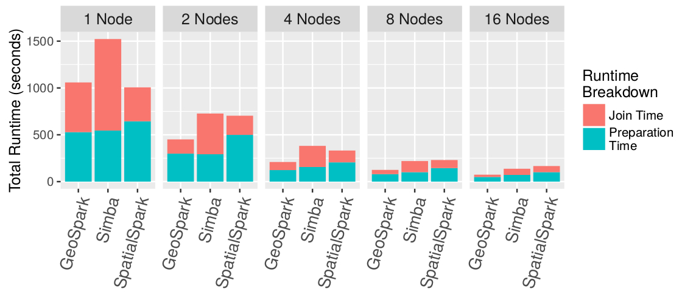

Distance join costs breakdown

  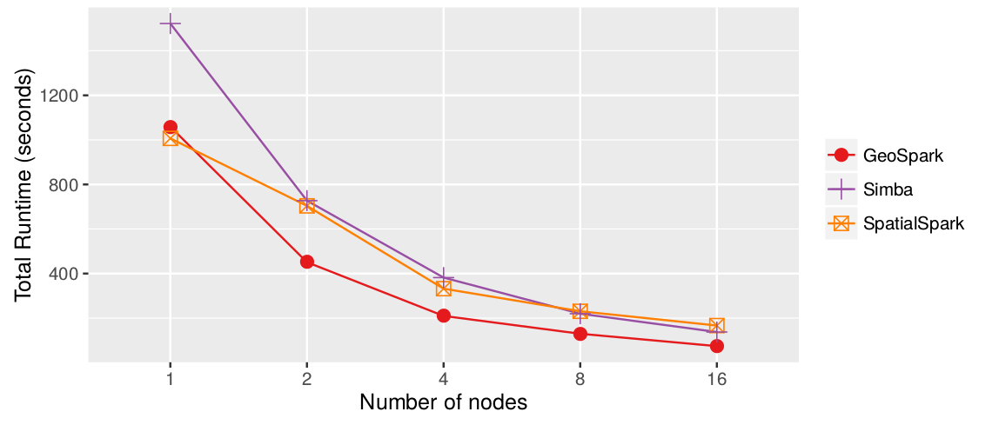

Distance join scalability

  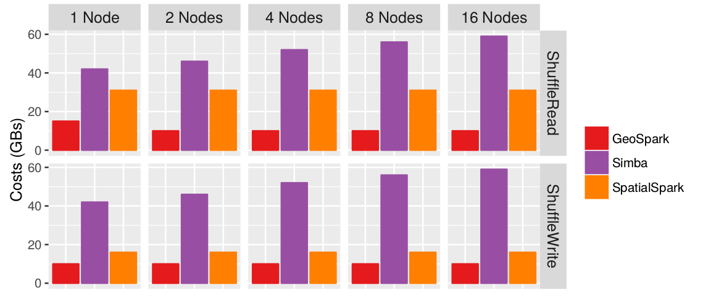

Distance join shuffle costs

---

## Spatial Joins Performance

  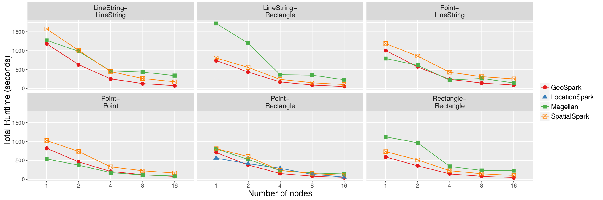

Spatial joins scalability

  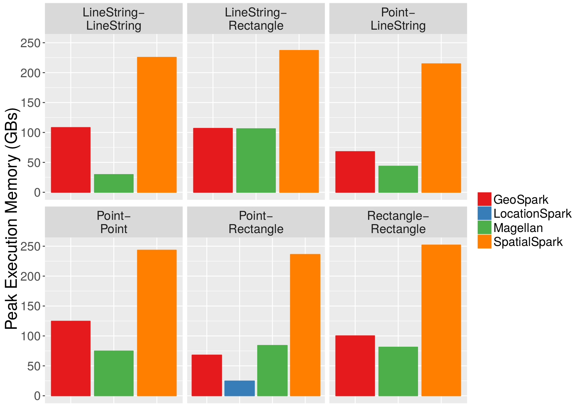

Spatial joins peak execution memory consumption

  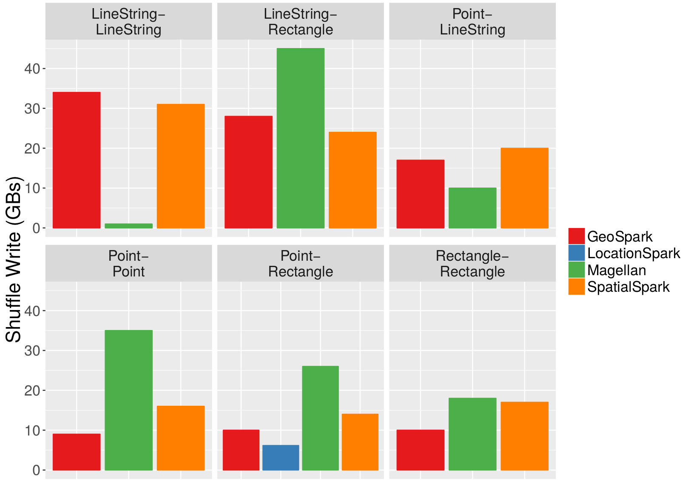

Spatial joins shuffle write costs

  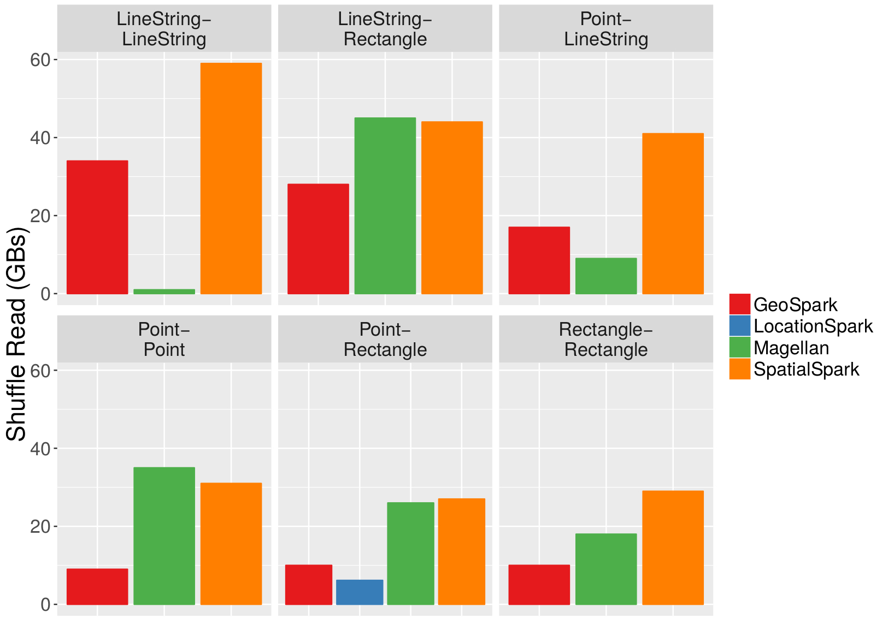

Spatial joins shuffle read costs

  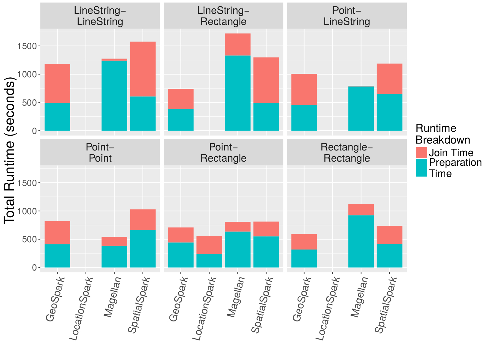

Spatial joins costs breakdown on a single node

  

Point-Rectangle spatial join costs breakdown scalinng up the number of nodes

---

## kNN Join Performance

  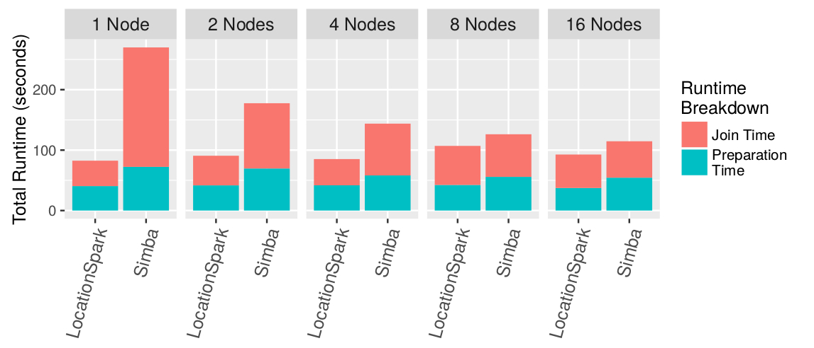

kNN join costs breakdown

  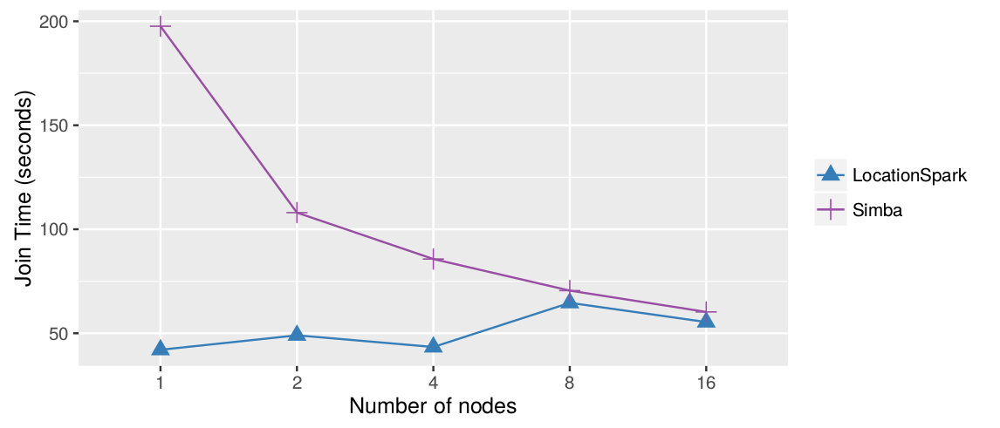

kNN join scalability

  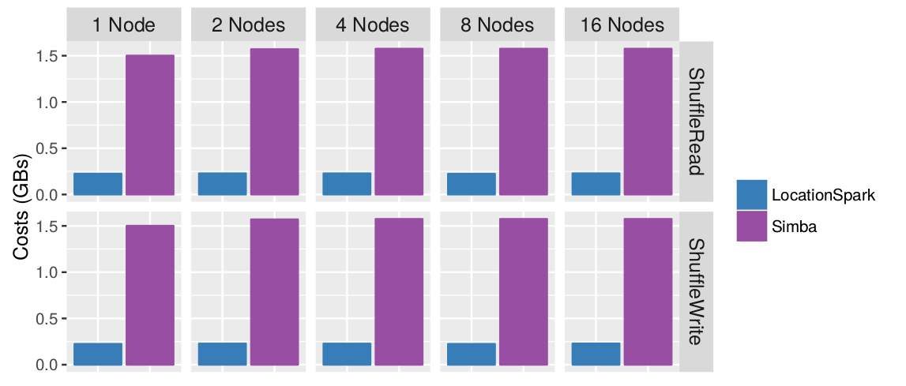

kNN join shuffle costs

